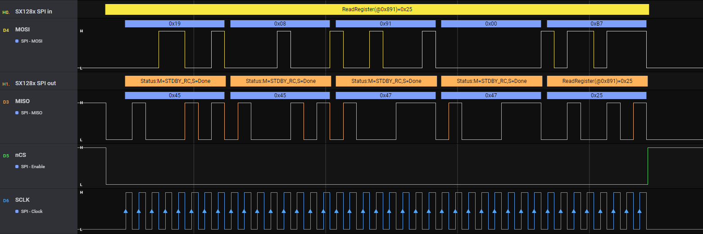

# HLA SX128x out SPI 

High-level-analyzer for Semtech SX128x 2.4GHz RF transceiver working on top of SPI low-level-analyzer (LLA). Analyzes especially the signal on the output direction to the SX128x and complements the [HLA SX128x in SPI](https://github.com/rotorman/saleae-hla-sx128x-in-spi)

